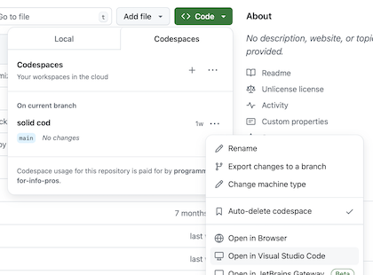
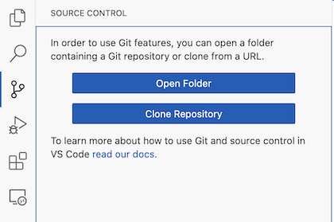
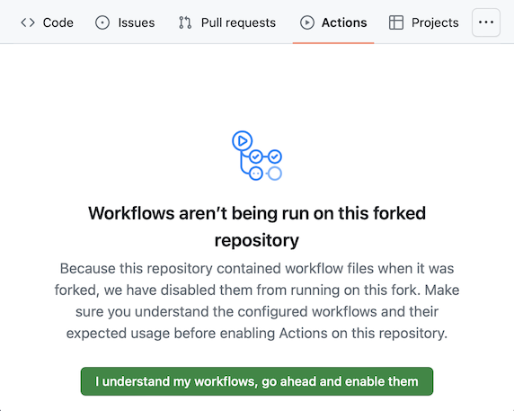

# Hello, World

The “Hello, World” program is traditionally the very first program
that people write when learning a computer programming language. It is
an exceptionally simple program, with no purpose other than to display
the phrase `Hello, World` when executed. It is intended to expose new
programmers to the syntax of a language, to the tools required to
author and run a program, and to other elements of the software
development environment.

## Open the assignment

One of the purposes of this assignment is to introduce you to
different options for opening and working on assignment
repositories. (*[What's a repository?][repo]*)

You can choose to open this assignment repository:

* in a GitHub codespace (a [container][container] running on the
  [Microsoft Azure][azure] cloud platform). **This is the best option
  for most people.**
* in a Dev Container (a container running on your personal
  computer). To do this you will need to install both Visual Studio
  Code and Docker on your personal computer. **This is the best option
  if your personal computer is relatively new and fast, but your
  Internet connectivity is slow or intermittent.**

If you open the repository in a codespace, you can access the codespace:

* via your Web browser. **This is the best option if you want to avoid
  installing anything on your personal computer.**
* via Visual Studio Code installed on your personal computer. **This is
  the best option if you already have Visual Studio Code installed on
  your personal computer, or you would like to install it.**

[repo]: https://docs.github.com/en/get-started/learning-about-github/github-glossary#repository
[container]: https://en.wikipedia.org/wiki/Containerization_(computing)
[azure]: https://en.wikipedia.org/wiki/Microsoft_Azure

### Open the repository in a GitHub codespace via your browser

This option will create a copy of the repository in a GitHub codespace
running in the cloud and accessible via your web browser.

To open this repository in a codespace, click the green **<> Code**
button above. In the panel that opens, go to the **Codespaces** tab,
and click the **Create codespace on main** button.

### Open the repository in a GitHub codespace via Visual Studio Code

This option will create a copy of the repository in a GitHub codespace
running in the cloud and accessible via Visual Studio Code running on
your personal computer.

First, follow the instructions above for [opening the repository in a
GitHub codespace via your
browser](#open-the-repository-in-a-github-codespace-via-your-browser).

Then, click the green **<> Code** button above. In the panel that
opens, go to the **Codespaces** tab. You should see the codespace you
just created. It will have a randomly generated name like `solid
cod`. (If you do not see it, try refreshing the page.)

To open the codespace in Visual Studio code, click the **…** next to
the codespace and select **Open in Visual Studio Code**, and then
follow the prompts.

### Open the repository in a Dev Container via Visual Studio Code

This option will create a copy of the repository in a container
running on your personal computer, and open it in Visual Studio Code
also running on your personal computer.

If you choose this option, first make sure that you have [set up Git
in VS Code][setup] and have signed into VS Code with your GitHub
account. Then, follow the instructions to [clone a repository
locally][local]. (“[Clone][clone]” means “copy.”)

You should see a repository named `<your-github-username>/hello-world`
in the list of repositories available to clone. (Make sure you do not
accidentally clone the `programming-for-info-pros/hello-world`
repository.)

Once you’ve selected the repository to clone, you’ll be prompted to
pick a local folder on your computer as the destination of your
repository. If (for example) you pick a folder named `Code`, then
cloning the `<your-github-username>/hello-world` repository will
create a folder named `hello-world` inside the `Code` folder.

Next you'll be asked if you trust the authors of the code, which
you should.

At some point, a notification should pop up in the lower right corner
asking if you want to reopen the folder in a container. You should do
this.

If you miss the notification, click the bell icon in the lower right
corner to show it again.

[clone]: https://docs.github.com/en/get-started/learning-about-github/github-glossary#clone
[setup]: https://code.visualstudio.com/docs/sourcecontrol/intro-to-git#_set-up-git-in-vs-code
[local]: https://code.visualstudio.com/docs/sourcecontrol/intro-to-git#_clone-a-repository-locally

<!-- TODO: rest of process for setting up a Dev Container -->

## Submitting this assignment

You submit this assignment by pushing the changes you make in your
codespace back to this repository.

The repository is set up to automatically run acceptance tests
whenever you push changes. However, you first need to grant permission
for them to run. Click the **Actions** tab at the top of the page, and
then agree to enable workflows.

Now you can try running the tests manually. Select **acceptance
tests** in the sidebar on the left, and then click the **Run
workflow** button on the right (you want the default, from branch
`main`).

The test should fail, since you haven't written any code to make it
pass yet!

Once you've done the above, you should be able to see the current
status of the tests below.

<!-- Local Variables: -->
<!-- jinx-local-words: "Codespaces Dev codespace" -->
<!-- End: -->
