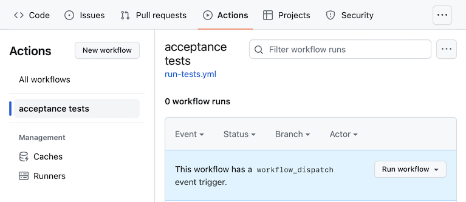

# Hello, World

The "Hello, World" program is traditionally the very first program
that people write when learning a computer programming
language. It is an exceptionally simple program, with no purpose other
than to display the phrase "Hello, World!" when executed. It is
intended to expose new programmers to the syntax of a language, to the
tools required to author and run a program, and to other elements of
the software development environment.

## Open the assignment

You can choose to open your repository for this assignment in Visual
Studio Code (running on your laptop) or in a GitHub codespace (running
in a remote cloud container).

### Open your repository in Visual Studio Code

This option will create a copy ([“clone”][clone]) of the repository on
your laptop, and open it in Visual Studio Code running on your laptop.

If you choose this option, first make sure that you have [set up Git
in VS Code][setup] and have signed into VS Code with your GitHub
account.

Then, follow the instructions to [clone a repository
locally][local]. You should see a repository named
`[your-github-username]/hello-world` in the list of repositories
available to clone. (Make sure you do not accidentally clone the
`programming-for-info-pros/hello-world` repository.)

[clone]: https://docs.github.com/en/get-started/learning-about-github/github-glossary#clone
[setup]: https://code.visualstudio.com/docs/sourcecontrol/intro-to-git#_set-up-git-in-vs-code
[local]: https://code.visualstudio.com/docs/sourcecontrol/intro-to-git#_clone-a-repository-locally

### Open your repository in a GitHub codespace

This option will create a copy ([“clone”][clone]) of the repository on
a remote cloud container, and open it in Visual Studio Code running on
that container, accessible via your web browser.

To open this repository in a codespace, click the green `<> Code` button
above. In the panel that opens, go to the `Codespaces` tab, and click the
`Create codespace on main` button.

## Submitting this assignment

You submit this assignment by pushing the changes you make in your
codespace back to this repository.

The repository is set up to automatically run acceptance tests
whenever you push changes. However, you first need to grant permission
for them to run. Click the `Actions` tab at the top of the page, and
then agree to enable workflows.

---

Now you can try running the tests manually. Select `acceptance tests`
in the sidebar on the left, and then click the `Run workflow` button
on the right (you want the default, from branch `main`).

---

The test should fail, since you haven't written any code to make it
pass yet!

Once you've done the above, you should be able to see the current
status of the tests below.

<!-- Local Variables: -->
<!-- jinx-local-words: "codespace" -->
<!-- End: -->
